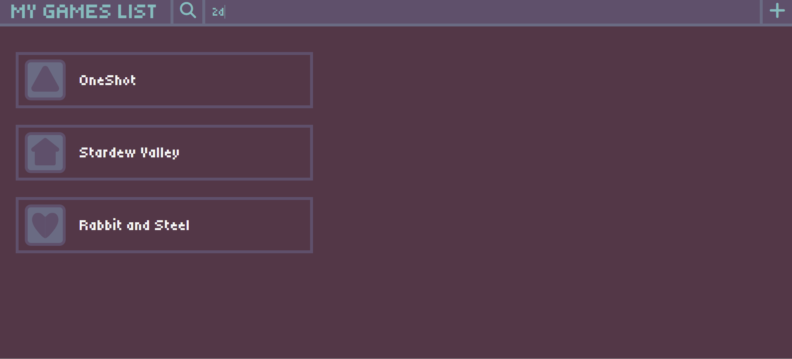

# MyGamesList

Track all your games. A .NET project for list-like games tracking. User can add their game, when they started, how they rate it and other informations. Data is managed with **RESTful API** and saved in database.

*There is no authentication for accessing CRUD operations.*

## Stacks

### Frontend
- **Blazor components**
- **CSS**

### Backend
- **ASP.NET Core**

### Database
- **SQLite**

## Overview

### Games

User can add a game and following information about it:

- Title
- Release date and Playing Since date
- Rating
- Game description
- Icon
- Tags

CRUD operations can be easily performed in app. On main page user can easily **search for a game** by title or tag.

### Tags

Each game can have **multiple** tags. Games:Tags relation is **N:M**. When deleting a game with tags only present in that game, tags will also be deleted from database

## Screenshots

### Main Page

Default look when no data is present in database

Window for details of game in list

A search function that works for titles or tags

### Adding Game Page

### Editing Game Page

